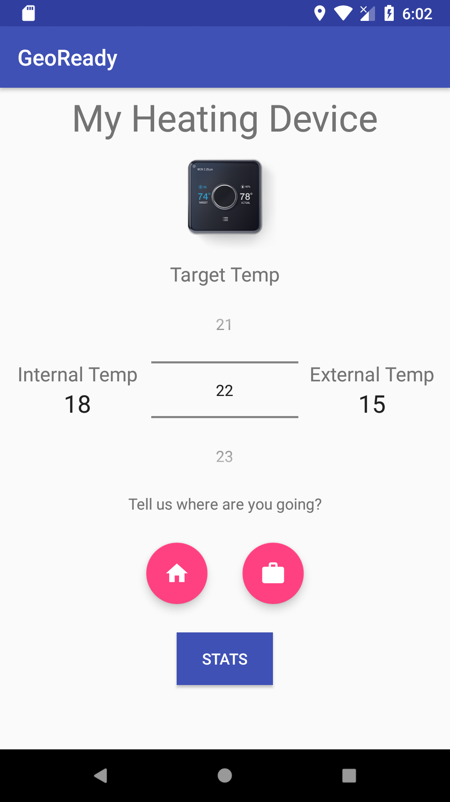
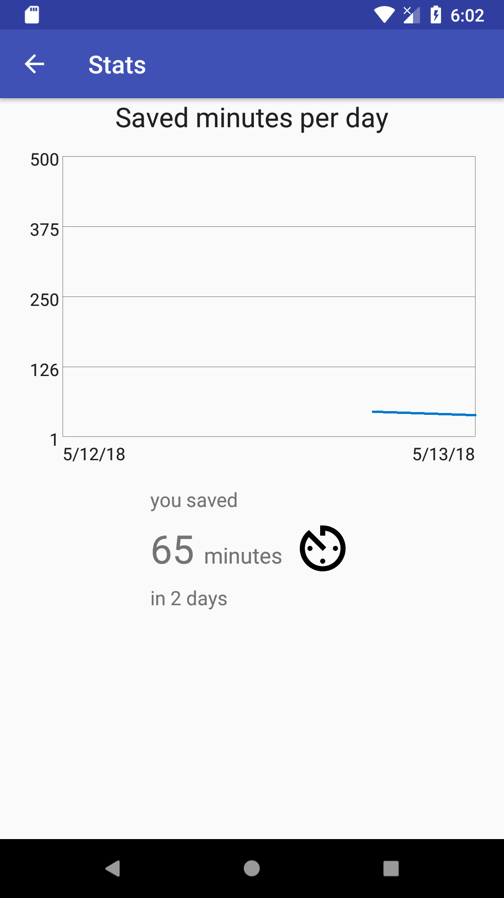
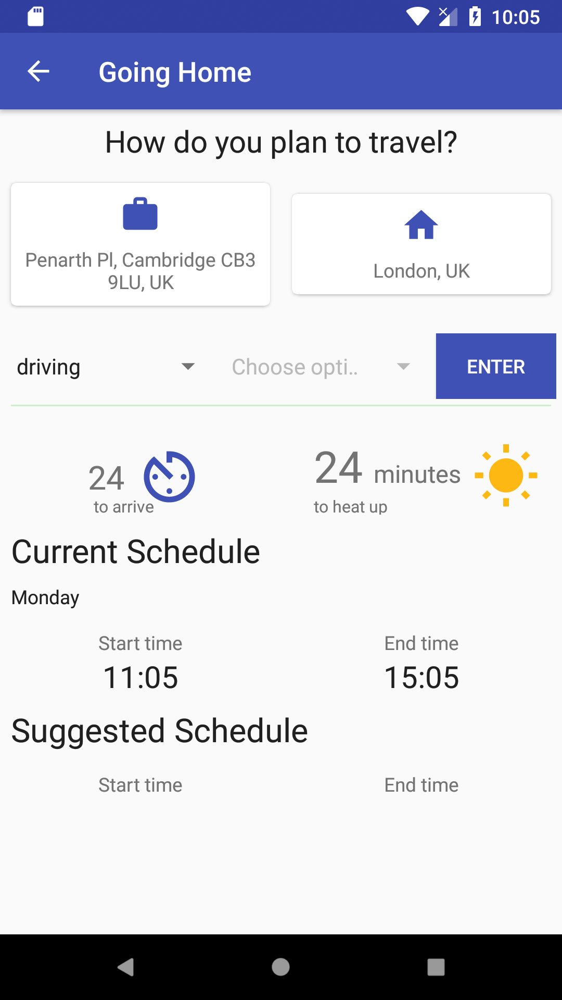

# GeoReady

## Hackathon

This app is part of the hackathon organized by Kevin Tsai in the Hive team during 12-13 of May 2018. The idea of the
hackathon is to save the earth from all of the pollution that happens in a way that is close to the Hive idea. Hive is
an energy company focused on IoT devices to manage your home automatically.

## Idea

Our idea was to improve the Hive app by creating using geolocation. 

Hive has a device called thermostat that controls the heating in your home. By using geolocation we can update the schedule
of this device to be more accurate so if it takes you 2 hours to get home, the device won't start until you are close by.
This way we save unnecessary energy that is used when you are not at home.

## Implementation

### Python

Thanks to Michal we used some of the users data to export an average function that can be used to tell how much time is
needed for you home to be heated up to the temperature that you want. This function used the Kalman filter.

We just setupped a Flask python server that accepts external temperature, internal temp and target temp and it returns
to you the time needed to heat your home.

### Android

On Android we have three screens

#### Stats screen

Display how much energy time (we cannot tell you how much money because it is individual for each boiler) you saved this week by using our automatic schedule feature.

#### Main screen

This is where we take your current location every 10 seconds. After you press the button that you are going home we 
assume your current location is your work location. And if you press you are going to work - your current location is
your home location. This was implemented this way because we didn't have much time to make the process automatically.

#### Going Home screen

Because we already have the Going to work screen where after you leave certain geofencing area we turn off all of your devices,
we decided to implement the Going Home screen.

You say how you plan to go home (bus, train, car) and we calculate the needed time to get to there by making a request to
Google Maps API. After that we make a request to the Python server to tell us how much time is needed to heat up your home
to the target temp you want.

After we do the above 2 requests we get your current schedule and do the math to suggest to you the appropriate time to
turn on your heating. So if you are going to be late with 1 hour because of the traffic, we can turn your heating 1 hour later and save you this time. The idea is to have your home heated when you already reach it.

#### Libs

 - Retrofit for requests to Google Maps API
 - GSON for Json parsing
 - JJoe64 GraphView as graph visualization library
 - Hotchemi PermissionsDispatcher to handle permissions in 6.0+
 - JodaTime for Android to manage time

#### Screenshots

  

## More Info

[LINK](https://drive.google.com/open?id=1OCKvlg3PwZJ6xebZ3fZCCJj0jY5DcStc)
